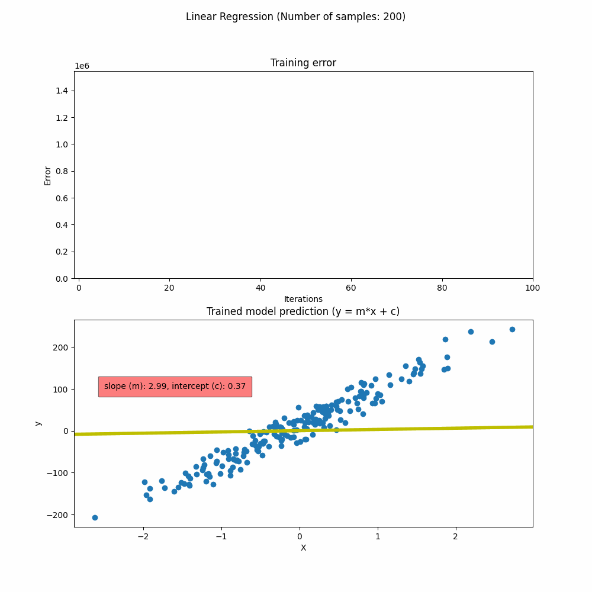

# GPU Parallelization and Vectorization
Exploring the benefits of using vectorized, parallelized implementations

## Notebooks

### **[1 Basic Vectorization](01_basic_vectorization.ipynb)**
This notebook explores the benefits of vectorization of using matrix multiplications _(matmul)_ instead of for-loops. We execute the following comparisons:
- 1D * 1D array for matrix sizes 10, 100, 1000, 10000, 100000 (**CPU**)
- ND * ND array for matrix sizes 10, 100, 1000 (**CPU**)
- ND * ND array for matrix sizes 10, 100, 1000, 10000 (**GPU**, comparing with respect to _FP16_)

In the final comparison, the benefits of using _FP16_ computation using tensor cores in Nvidia GPUs is highlighted.

    
### **[2 Linear Regression](02_linear_regression.ipynb)**
In this notebook, we evaluate the benefits of using vectorization with GPU in simple machine learning task: Linear Regression. Simple noisy regression dataset with different number of samples: **20, 200, 500, 1000, 2000** using _sklearn.datasets.make_regression()_. The slope variables _(m, c)_ are initialized with 0.0 and using standard gradient descent trained for **100 epochs** with learning rate 0.0001. The main comparison is drawn here between **for-loop** vs **matrix algebra** based cost-calculation over all the samples. The training error and improvement of the slope prediction is also visualized in a elegant .gif:

### **[3 Convolutional Neural Networks](03_CNN.ipynb)**
In this notebook, we evaluate the benefits of using vectorization with GPU in a common deep learning task: Training Convolution Neural Network. We use CIFAR-10 dataset (using one-third of total training dataset to speed up training) with a simple CNN network consisting of 2 CNN layers followed by 3 Linear layers to get the final classification result.

In the last two notebooks, the superiority of matrix algebra is systematically proven over for-loops, so we will directly use them without further comparison between them. This notebook , the benefits of vectorization using GPUs is proven through varying number of **batchsize: 4, 16, 64, 256, 512**. Batchsize is the number of samples used for training in one training step. Increasing the batchsize would result in faster training speed but at some point might show degradation in accuracy (as seen below)

## Presentation
> This project has been developed and evaluated as a part of *Planning and Decision-Making Algorithms lecture* in 6th Semester for *Autonomous Vehicle Engineering (B.Eng)* course  at *Technische Hochschule Ingolstadt*

All of the above findings from the notebooks were presented as a seminar. The powerpoint used could be found [here](Vishal_PDMA_final_presentation.pdf)